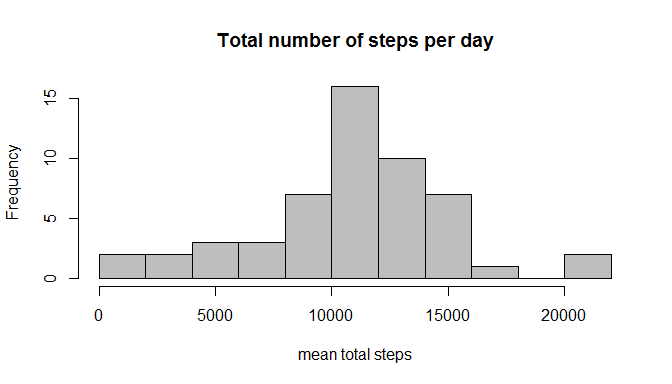
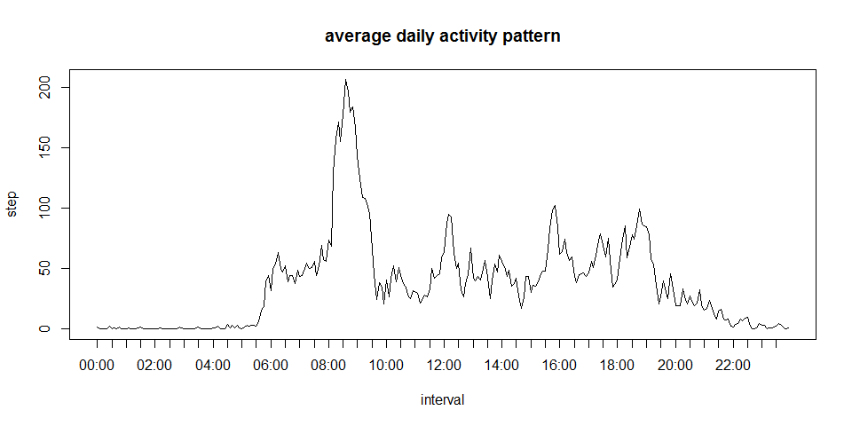
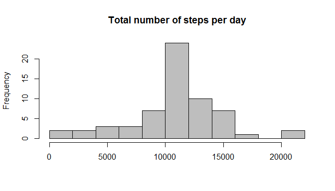
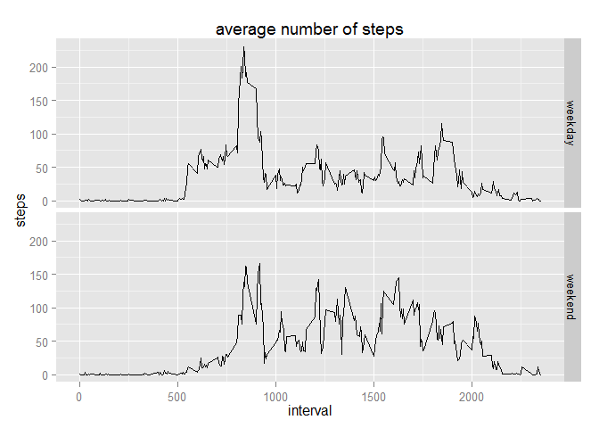

# Reproducible Research: Peer Assessment 1
  
  
## Loading and preprocessing the data
Download and unzip (if necessary). Then read the csv-file.  
For the first part of the assignment, remove the incomplete cases.  


```r
amdata="activity.csv"
if (!file.exists(amdata)){
      zipfile="activity.zip"
      if (!file.exists(zipfile)){
             url="https://d396qusza40orc.cloudfront.net/repdata%2Fdata%2Factivity.zip"
             download.file(url,zipfile, mode = "wb")
            }
      unzip(zipfile)
      }
dat0=read.csv(amdata,header=TRUE,na.strings = "NA",colClasses=c("integer","Date","integer"))

#remove incomlete cases
dat=dat0[complete.cases(dat0),]
```
  
## What is mean total number of steps taken per day?

First, make a dataset with the total number of steps for every day.   

```r
tot_steps=aggregate(dat$steps, by=list(dat$date),FUN=sum)
names(tot_steps)=c("date","steps")
```
Then make a histogram and calculate the mean and median  

```r
br=ceiling(sqrt(nrow(tot_steps))) #squareroot-methode to indicate number of bars
hist(tot_steps$steps,breaks=br,main="Total number of steps per day",xlab="mean total steps",col="gray")
```

 

```r
mean_steps=format(mean(tot_steps$steps,na.rm=TRUE))
median_steps=median(tot_steps$steps,na.rm=TRUE)
```
The mean total number of steps is 10766.19.  
The median is: 10765  
  
## What is the average daily activity pattern?
First make a dataset with the mean number of steps per interval.   

```r
av_steps=aggregate(dat$steps, by=list(dat$interval),FUN=mean)
names(av_steps)=c("interval","steps")
```
Plot the average daily activity pattern. Because the time-intervals are notated as integers, the (base) plot will add the intervals 60 to 95, 160 to 195 etc.  
To avoid this, plot over the rank of the intervals (interval 0 has rank 1, 5 has rank 2 etc.) to keep the order. The function "NumberToTime" will format the interval notation an will be used on the x-axis. 

```r
NumberToTime=function(n){
      # 4 positions
      d4=formatC(n, width = 4, format = "d", flag = "0")  
      part1=substring(d4,1,2)
      part2=substring(d4,3,4)
      paste(part1,part2,sep=":")
                      
}
av_steps$axlabel=NumberToTime(av_steps$interval)
av_steps$r=rank(av_steps$interval)
ticks=av_steps$r[seq(from=1,to=288,by=6)] # tick on every half hour

plot( av_steps$r,av_steps$steps,type="l"
     ,main="average daily activity pattern",xlab="interval",ylab="step",xaxt="n")
axis(1,at=ticks,labels=av_steps$axlabel[ticks]) # add the x-labels
```

 
Now calculate the interval which contains the maximum number of steps.

```r
maxsteps=av_steps[which.max(av_steps$steps),]
```
Interval 835 has the maximum daily average number of steps: 206.1698113 steps a day.  

## Imputing missing values
Count the Na's for the dataset

```r
na_interval=sum(is.na(dat0$interval))
na_steps=sum(is.na(dat0$steps))
na_date=sum(is.na(dat0$date))
valid_rec=nrow(dat0[!complete.cases(dat0),])
```
The variable "interval" has 0 Na's.  
The variable "steps" has 2304 Na's.  
The variable "date" has 0 Na's.  
The csv-data has 2304 complete cases. 
For a complete dataset, I have to "repair" the NA's for the variable "steps".  
I will do that by replacing the NA by it's interval-avarage by merging the original datset with    
the (aggregated) dataset with the mean number of steps per interval.  

```r
dat0=merge(dat0,av_steps,by="interval", all.x=TRUE)
dat0$steps=ifelse(is.na(dat0$steps.x),dat0$steps.y,dat0$steps.x)
dat0=dat0[,c("interval","date","steps")]
```
Let's take a look at the histogram  of the total number of steps taken each day for this "repaired" dataset.   
First (as before), make a dataset with the total number of steps for every day.   

```r
tot_steps1=aggregate(dat0$steps, by=list(dat0$date),FUN=sum)
names(tot_steps1)=c("date","steps")
```
Then make a histogram and calculate mean and median  

```r
hist(tot_steps1$steps,breaks=br,main="Total number of steps per day",xlab="",col="gray")
```

 

```r
mean_steps1=format(mean(tot_steps1$steps))
median_steps1=format(median(tot_steps1$steps))
```
The mean total number of steps is now 10766.19 (was 10766.19).  
The median now is: 10766.19 (was 10765).  
There is no difference in the mean. This makes sense, since the NA's where replaced by the mean.  

  
## Are there differences in activity patterns between weekdays and weekends?  
For each day, calculate if it is a weekday or a weekend day.   

```r
Sys.setlocale("LC_TIME", "English")    # Set notation to English
```

```
## [1] "English_United States.1252"
```

```r
dat0$weekpart=ifelse(weekdays(dat0$date) %in%  c("Saturday","Sunday"),"weekend","weekday")
```
To show the difference in a plot, first make a dataset with the average number of steps by interval and the weekpart.    

```r
av_steps_weekpart=aggregate(dat0$steps, by=list(dat0$interval,dat0$weekpart),FUN=mean)
names(av_steps_weekpart)=c("interval","weekpart","steps")
```
Now, let's make a panel plot.


```r
library(ggplot2)
g=ggplot(av_steps_weekpart,aes(interval,steps)) + facet_grid(weekpart~.)+   labs(title="average number of steps") +geom_line() 
print(g)
```

 
